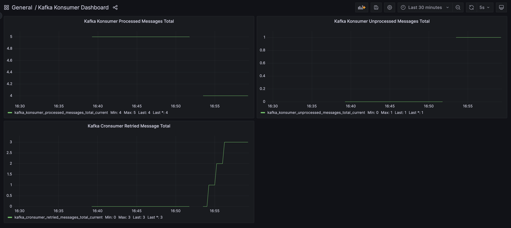

# Kafka Konsumer

[](https://github.com/Trendyol/kafka-konsumer/actions/workflows/test.yml)
[](https://github.com/Trendyol/kafka-konsumer/actions/workflows/integration-test.yml)
[](https://goreportcard.com/report/github.com/Trendyol/kafka-konsumer/v2)

<div style="text-align:center"></div>

## Description

Kafka Konsumer provides an easy implementation of Kafka consumer with a built-in retry/exception
manager ([kafka-cronsumer](https://github.com/Trendyol/kafka-cronsumer)).

## Migration Guide

### V2 Release Notes

- Added ability for manipulating kafka message headers.
- Added transactional retry feature. Set false if you want to use exception/retry strategy to only failed messages.
- Enable manuel commit at both single and batch consuming modes.
- Enabling consumer resume/pause functionality. Please refer to [its example](examples/with-pause-resume-consumer) and
  [how it works](examples/with-pause-resume-consumer/how-it-works.md) documentation.
- Bumped [kafka-cronsumer](https://github.com/Trendyol/kafka-cronsumer/releases) to the latest version:
    - Backoff strategy support (linear, exponential options)
    - Added message key for retried messages
    - Added x-error-message to see what was the error of the message during processing
- Reduce memory allocation.
- Increase TP on changing internal concurrency structure.

### How to migrate from v1 to v2?

You can get latest version via `go get github.com/Trendyol/kafka-konsumer/v2@latest`

- You need to change import path from `github.com/Trendyol/kafka-konsumer` to `github.com/Trendyol/kafka-konsumer/v2`

- You need to change your consume function with pointer signature.

- We moved messageGroupDuration from `batchConfiguration.messageGroupDuration` to root level. Because this field is used
  single (non-batch) consumer too.

### Installation

```sh
go get github.com/Trendyol/kafka-konsumer/v2@latest
```

### Examples

You can find a number of ready-to-run examples at [this directory](examples).

After running `docker-compose up` command, you can run any application you want.

<details>
    <summary>Simple Consumer</summary>

    func main() {
        consumerCfg := &kafka.ConsumerConfig{
            Reader: kafka.ReaderConfig{
                Brokers: []string{"localhost:29092"},
                Topic:   "standart-topic",
                GroupID: "standart-cg",
            },
            ConsumeFn:    consumeFn,
            RetryEnabled: false,
        }
    
        consumer, _ := kafka.NewConsumer(consumerCfg)
        defer consumer.Stop()
        
        consumer.Consume()
    }
    
    func consumeFn(message kafka.Message) error {
        fmt.Printf("Message From %s with value %s", message.Topic, string(message.Value))
        return nil
    }

</details>

<details>
    <summary>Simple Consumer With Retry/Exception Option</summary>

    func main() {
        consumerCfg := &kafka.ConsumerConfig{
            Reader: kafka.ReaderConfig{
                Brokers: []string{"localhost:29092"},
                Topic:   "standart-topic",
                GroupID: "standart-cg",
            },
            RetryEnabled: true,
            RetryConfiguration: kafka.RetryConfiguration{
                Topic:         "retry-topic",
                StartTimeCron: "*/1 * * * *",
                WorkDuration:  50 * time.Second,
                MaxRetry:      3,
            },
            ConsumeFn: consumeFn,
        }
    
        consumer, _ := kafka.NewConsumer(consumerCfg)
        defer consumer.Stop()
        
        consumer.Consume()
    }
    
    func consumeFn(message kafka.Message) error {
        fmt.Printf("Message From %s with value %s", message.Topic, string(message.Value))
        return nil
    }

</details>

<details>
    <summary>With Batch Option</summary>

    func main() {
        consumerCfg := &kafka.ConsumerConfig{
            Reader: kafka.ReaderConfig{
                Brokers: []string{"localhost:29092"},
                Topic:   "standart-topic",
                GroupID: "standart-cg",
            },
            LogLevel:     kafka.LogLevelDebug,
            RetryEnabled: true,
            RetryConfiguration: kafka.RetryConfiguration{
                Brokers:       []string{"localhost:29092"},
                Topic:         "retry-topic",
                StartTimeCron: "*/1 * * * *",
                WorkDuration:  50 * time.Second,
                MaxRetry:      3,
            },
            MessageGroupDuration: time.Second,
            BatchConfiguration: kafka.BatchConfiguration{
                MessageGroupLimit:    1000,
                BatchConsumeFn:       batchConsumeFn,
            },
        }
    
        consumer, _ := kafka.NewConsumer(consumerCfg)
        defer consumer.Stop()
    
        consumer.Consume()
    }
    
    func batchConsumeFn(messages []kafka.Message) error {
        fmt.Printf("%d\n comes first %s", len(messages), messages[0].Value)
        return nil
    }

</details>

<details>
    <summary>With Disabling Transactional Retry</summary>

    func main() {
        consumerCfg := &kafka.ConsumerConfig{
            Reader: kafka.ReaderConfig{
                Brokers: []string{"localhost:29092"},
                Topic:   "standart-topic",
                GroupID: "standart-cg",
            },
            LogLevel:     kafka.LogLevelDebug,
            RetryEnabled: true,
            TransactionalRetry: kafka.NewBoolPtr(false),
            RetryConfiguration: kafka.RetryConfiguration{
                Brokers:       []string{"localhost:29092"},
                Topic:         "retry-topic",
                StartTimeCron: "*/1 * * * *",
                WorkDuration:  50 * time.Second,
                MaxRetry:      3,
            },
            MessageGroupDuration: time.Second,
            BatchConfiguration: kafka.BatchConfiguration{
                MessageGroupLimit:    1000,
                BatchConsumeFn:       batchConsumeFn,
            },
        }
    
        consumer, _ := kafka.NewConsumer(consumerCfg)
        defer consumer.Stop()
    
        consumer.Consume()
    }
    
    func batchConsumeFn(messages []kafka.Message) error {
        // you can add custom error handling here & flag messages
        for i := range messages {
            if i%2 == 0 {
                messages[i].IsFailed = true
            }
        }
    
        // you must return err here to retry failed messages
        return errors.New("err")
    }

</details>

#### With Distributed Tracing Support

Please refer to [Tracing Example](examples/with-tracing/README.md)

#### With Pause & Resume Consumer

Please refer to [Pause Resume Example](examples/with-pause-resume-consumer)

#### With Grafana & Prometheus

In this example, we are demonstrating how to create Grafana dashboard and how to define alerts in Prometheus. You can
see the example by going to the [with-grafana](examples/with-grafana) folder in the [examples](examples) folder
and running the infrastructure with `docker compose up` and then the application.



#### With SASL-PLAINTEXT Authentication

Under the [examples](examples) - [with-sasl-plaintext](examples/with-sasl-plaintext) folder, you can find an example
of a consumer integration with SASL/PLAIN mechanism. To try the example, you can run the command `docker compose up`
under [the specified folder](examples/with-sasl-plaintext) and then start the application.

## Configurations

| config                                           | description                                                                                                                                                                                                                                                                                                                                                                                             | default                     |
|--------------------------------------------------|---------------------------------------------------------------------------------------------------------------------------------------------------------------------------------------------------------------------------------------------------------------------------------------------------------------------------------------------------------------------------------------------------------|-----------------------------|
| `reader`                                         | [Describes all segmentio kafka reader configurations](https://pkg.go.dev/github.com/segmentio/kafka-go#ReaderConfig)                                                                                                                                                                                                                                                                                    |                             |
| `consumeFn`                                      | Kafka consumer function, if retry enabled it, is also used to consume retriable messages                                                                                                                                                                                                                                                                                                                |                             |
| `skipMessageByHeaderFn`                          | Function to filter messages based on headers, return true if you want to skip the message                                                                                                                                                                                                                                                                                                               | nil                         |
| `logLevel`                                       | Describes log level; valid options are `debug`, `info`, `warn`, and `error`                                                                                                                                                                                                                                                                                                                             | info                        |
| `concurrency`                                    | Number of goroutines used at listeners                                                                                                                                                                                                                                                                                                                                                                  | 1                           |
| `retryEnabled`                                   | Retry/Exception consumer is working or not                                                                                                                                                                                                                                                                                                                                                              | false                       |
| `transactionalRetry`                             | Set false if you want to use exception/retry strategy to only failed messages                                                                                                                                                                                                                                                                                                                           | true                        |
| `commitInterval`                                 | indicates the interval at which offsets are committed to the broker.                                                                                                                                                                                                                                                                                                                                    | 1s                          |
| `verifyTopicOnStartup`                           | it checks existence of the given topic(s) on the kafka cluster.                                                                                                                                                                                                                                                                                                                                         | false                       |
| `rack`                                           | [see doc](https://pkg.go.dev/github.com/segmentio/kafka-go#RackAffinityGroupBalancer)                                                                                                                                                                                                                                                                                                                   |                             |
| `clientId`                                       | [see doc](https://pkg.go.dev/github.com/segmentio/kafka-go#Dialer)                                                                                                                                                                                                                                                                                                                                      |                             |
| `messageGroupDuration`                           | Maximum time to wait for a batch                                                                                                                                                                                                                                                                                                                                                                        | 1s                          |
| `metricPrefix`                                   | MetricPrefix is used for prometheus fq name prefix. If not provided, default metric prefix value is `kafka_konsumer`. Currently, there are two exposed prometheus metrics. `processed_messages_total` and `unprocessed_messages_total` So, if default metric prefix used, metrics names are `kafka_konsumer_processed_messages_total_current` and `kafka_konsumer_unprocessed_messages_total_current`.  | kafka_konsumer              |
| `dial.Timeout`                                   | [see doc](https://pkg.go.dev/github.com/segmentio/kafka-go#Dialer)                                                                                                                                                                                                                                                                                                                                      | no timeout                  |
| `dial.KeepAlive`                                 | [see doc](https://pkg.go.dev/github.com/segmentio/kafka-go#Dialer)                                                                                                                                                                                                                                                                                                                                      | not enabled                 |
| `transport.DialTimeout `                         | [see doc](https://pkg.go.dev/github.com/segmentio/kafka-go@#Transport)                                                                                                                                                                                                                                                                                                                                  | 5s                          |
| `transport.IdleTimeout `                         | [see doc](https://pkg.go.dev/github.com/segmentio/kafka-go@#Transport)                                                                                                                                                                                                                                                                                                                                  | 30s                         |
| `transport.MetadataTTL `                         | [see doc](https://pkg.go.dev/github.com/segmentio/kafka-go@#Transport)                                                                                                                                                                                                                                                                                                                                  | 6s                          |
| `transport.MetadataTopics `                      | [see doc](https://pkg.go.dev/github.com/segmentio/kafka-go@#Transport)                                                                                                                                                                                                                                                                                                                                  | all topics in cluster       |
| `distributedTracingEnabled`                      | indicates open telemetry support on/off for consume and produce operations.                                                                                                                                                                                                                                                                                                                             | false                       |
| `distributedTracingConfiguration.TracerProvider` | [see doc](https://opentelemetry.io/docs/specs/otel/trace/api/)                                                                                                                                                                                                                                                                                                                                          | otel.GetTracerProvider()    |
| `distributedTracingConfiguration.Propagator`     | [see doc](https://opentelemetry.io/docs/specs/otel/trace/api/)                                                                                                                                                                                                                                                                                                                                          | otel.GetTextMapPropagator() |
| `retryConfiguration.clientId`                    | [see doc](https://pkg.go.dev/github.com/segmentio/kafka-go@#Transport)                                                                                                                                                                                                                                                                                                                                  |                             |
| `retryConfiguration.startTimeCron`               | Cron expression when retry consumer ([kafka-cronsumer](https://github.com/Trendyol/kafka-cronsumer#configurations)) starts to work at                                                                                                                                                                                                                                                                   |                             |
| `retryConfiguration.metricPrefix`                | MetricPrefix is used for prometheus fq name prefix. If not provided, default metric prefix value is kafka_cronsumer. Currently, there are two exposed prometheus metrics. retried_messages_total_current and discarded_messages_total_current. So, if default metric prefix used, metrics names are kafka_cronsumer_retried_messages_total_current and kafka_cronsumer_discarded_messages_total_current | kafka_cronsumer             |
| `retryConfiguration.workDuration`                | Work duration exception consumer actively consuming messages                                                                                                                                                                                                                                                                                                                                            |                             |
| `retryConfiguration.topic`                       | Retry/Exception topic names                                                                                                                                                                                                                                                                                                                                                                             |                             |
| `retryConfiguration.brokers`                     | Retry topic brokers urls                                                                                                                                                                                                                                                                                                                                                                                |                             |
| `retryConfiguration.maxRetry`                    | Maximum retry value for attempting to retry a message                                                                                                                                                                                                                                                                                                                                                   | 3                           |
| `retryConfiguration.tls.rootCAPath`              | [see doc](https://pkg.go.dev/crypto/tls#Config.RootCAs)                                                                                                                                                                                                                                                                                                                                                 | ""                          |
| `retryConfiguration.tls.intermediateCAPath`      | Same with rootCA, if you want to specify two rootca you can use it with rootCAPath                                                                                                                                                                                                                                                                                                                      | ""                          |
| `retryConfiguration.sasl.authType`               | `SCRAM` or `PLAIN`                                                                                                                                                                                                                                                                                                                                                                                      |                             |
| `retryConfiguration.sasl.username`               | SCRAM OR PLAIN username                                                                                                                                                                                                                                                                                                                                                                                 |                             |
| `retryConfiguration.sasl.password`               | SCRAM OR PLAIN password                                                                                                                                                                                                                                                                                                                                                                                 |                             |
| `retryConfiguration.skipMessageByHeaderFn`       | Function to filter messages based on headers, return true if you want to skip the message	                                                                                                                                                                                                                                                                                                              | nil                         |
| `retryConfiguration.verifyTopicOnStartup`        | it checks existence of the given retry topic on the kafka cluster.  	                                                                                                                                                                                                                                                                                                                                   | false                       |
| `batchConfiguration.messageGroupLimit`           | Maximum number of messages in a batch                                                                                                                                                                                                                                                                                                                                                                   |                             |
| `batchConfiguration.messageGroupByteSizeLimit`   | Maximum number of bytes in a batch                                                                                                                                                                                                                                                                                                                                                                      |                             |
| `batchConfiguration.batchConsumeFn`              | Kafka batch consumer function, if retry enabled it, is also used to consume retriable messages                                                                                                                                                                                                                                                                                                          |                             |
| `batchConfiguration.preBatchFn`                  | This function enable for transforming messages before batch consuming starts                                                                                                                                                                                                                                                                                                                            |                             |
| `batchConfiguration.balancer`                    | [see doc](https://pkg.go.dev/github.com/segmentio/kafka-go#Balancer)                                                                                                                                                                                                                                                                                                                                    | leastBytes                  |
| `tls.rootCAPath`                                 | [see doc](https://pkg.go.dev/crypto/tls#Config.RootCAs)                                                                                                                                                                                                                                                                                                                                                 | ""                          |
| `tls.intermediateCAPath`                         | Same with rootCA, if you want to specify two rootca you can use it with rootCAPath                                                                                                                                                                                                                                                                                                                      | ""                          |
| `sasl.authType`                                  | `SCRAM` or `PLAIN`                                                                                                                                                                                                                                                                                                                                                                                      |                             |
| `sasl.username`                                  | SCRAM OR PLAIN username                                                                                                                                                                                                                                                                                                                                                                                 |                             |
| `sasl.password`                                  | SCRAM OR PLAIN password                                                                                                                                                                                                                                                                                                                                                                                 |                             |
| `logger`                                         | If you want to custom logger                                                                                                                                                                                                                                                                                                                                                                            | info                        |
| `apiEnabled`                                     | Enabled metrics                                                                                                                                                                                                                                                                                                                                                                                         | false                       |
| `apiConfiguration.port`                          | Set API port                                                                                                                                                                                                                                                                                                                                                                                            | 8090                        |
| `apiConfiguration.healtCheckPath`                | Set Health check path                                                                                                                                                                                                                                                                                                                                                                                   | healthcheck                 |
| `metricConfiguration.path`                       | Set metric endpoint path                                                                                                                                                                                                                                                                                                                                                                                | /metrics                    |

## Monitoring

Kafka Konsumer offers an API that handles exposing several metrics.

### Exposed Metrics

| Metric Name                                       | Description                           | Value Type |
|---------------------------------------------------|---------------------------------------|------------|
| kafka_konsumer_processed_messages_total_current   | Total number of processed messages.   | Counter    |
| kafka_konsumer_unprocessed_messages_total_current | Total number of unprocessed messages. | Counter    |
