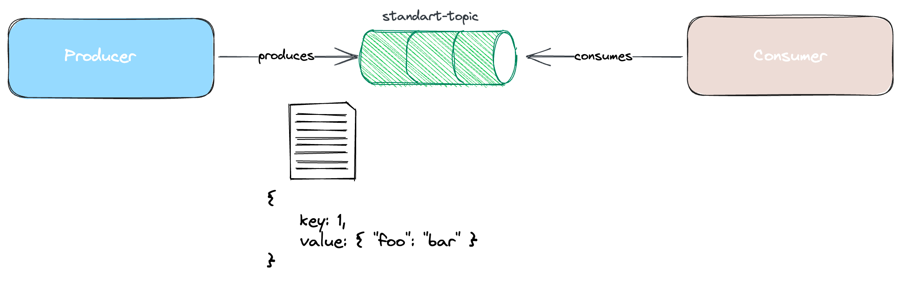
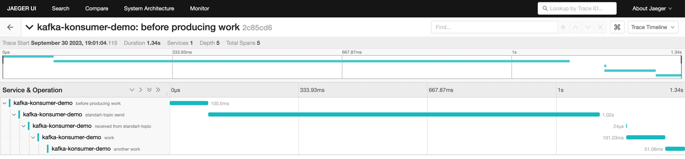

### Distributed Tracing

[segmentio/kafka-go](https://github.com/segmentio/kafka-go) has no support for open telemetry. 
There is also an [issue](https://github.com/segmentio/kafka-go/issues/1025) about it.
Based on some work on that issue, we created a project called [otel-kafka-konsumer](https://github.com/Abdulsametileri/otel-kafka-konsumer).

By integrating this project with kafka-konsumer, we successfully implemented distributed tracing in consuming
and producing operations. You can run demo. 

In this demo, we chose jaeger to show how to integrate distributed tracing on your project using kafka-konsumer. 
But zipkin, stdout, and other alternatives are still applicable

Two settings are significant.
- trace.TracerProvider _(you can set jaeger,zipkin etc.)_
- propagation.TextMapPropagator (please refer to [here](https://opentelemetry.io/docs/specs/otel/context/api-propagators/))

If you have not specified its values, kafka-konsumer uses global.TraceProvider and Propagation.

### Demo overview



### How to run demo?

You should run [docker-compose.yml](../docker-compose.yml) by

```sh
docker-compose up build
```

You should run jaeger by

```sh
docker run -d --name jaeger -e COLLECTOR_OTLP_ENABLED=true -p 14268:14268 -p 16686:16686 -p 4318:4318 jaegertracing/all-in-one:latest
```

You can access the jaeger dashboard as [jaeger dashboard](http://localhost:16686/search)

You can run the demo as `go run main.go`

In the producing step, we open only two spans. In the consuming step, we open three spans. You can see their relationship via the jeager dashboard, as shown below.

